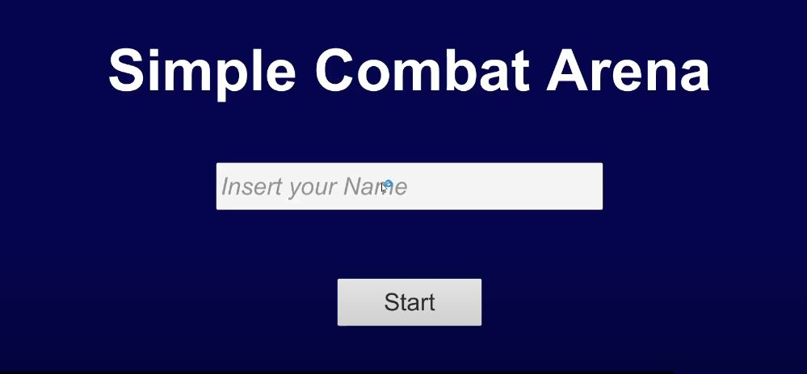
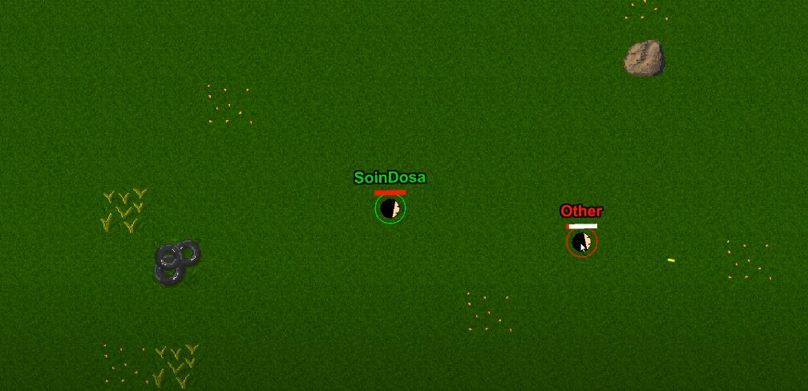

# Simple Combat Arena
## 개발 참여자
### SoinDosa(기획, 개발, 디자인(일부))

## 개발 환경
### Language : C#
### Graphic : Piskel
### IDE : Unity 2020.1.3f1

## 어떤 게임인가?
복학을 하고 나서 한 학기가 지난 직후, 너무 학교수업에만 열중했나 싶어 잃어버린 유니티에 감을 찾기 위해 시작한 프로젝트입니다. 
유니티로 멀티플레이를 구현해보고 싶어 개발하게 되었고 유튜버 "고라니"님의 영상을 참고하였습니다. 
Photon PUN2를 활용한 2D 탑뷰 멀티플레이 슈팅게임이며 아직 완성되지 않은 프로젝트입니다. 

## 게임 스냅샷
 

## 게임 소개 영상
<a href="https://youtu.be/YjKWlMNbZc4">Youtube Link</a>
